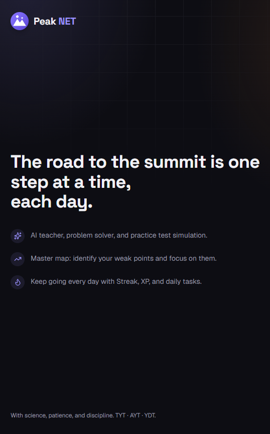

# PeakNET

> **The road to the summit is one step at a time, each day.**
> An all-tracks Turkish university-entrance (YKS) study platform: AI tutor, mock exams, mastery maps, spaced repetition, and focus tools — all in one app.

[](LICENSE)
[](https://yks-app-seven.vercel.app)
[](https://stardance.hackclub.com)

**Live:** https://yks-app-seven.vercel.app — open the demo, sign up, run a Pomodoro.



---

## What it is

PeakNET is a study platform built by a high-schooler for high-schoolers preparing for **YKS**, Turkey's two-stage university entrance exam (TYT + AYT + YDT). It covers every track — Sayısal (science), Eşit Ağırlık (equal-weight), Sözel (humanities), Dil (foreign language) — plus optional modules for **AP courses** and other abroad exams.

The goal is to own the whole study loop: pick a topic, study, get unstuck with an AI tutor, measure with mocks, see your weakest topics on a mastery map, and come back tomorrow. Built with Next.js 16, Supabase, and Google Gemini.

## Features

**Curriculum & mastery**
- 150+ topics across TYT, AYT (all tracks), and YDT (English)
- AP courses module (Calc AB/BC, Physics 1, Chemistry, Biology, CS A, Stats, Micro/Macro) + abroad-exams tab
- Khan-style per-topic mastery, confidence stars, personal notes, multi-type resources

**AI (Google Gemini)**
- Tutor mode — free chat + PDF-grounded
- Photo question solver (multimodal)
- AI-generated mock exams, quiz scans, flashcards, weekly study program
- AI drawing board (function graphs, geometry, coordinate plane — constrained JSON schema)
- AI note-taker (markdown notes from any topic, print-to-PDF)
- Weekly AI coach (7-day report from your activity)
- Per-user daily rate limit

**Practice**
- Interactive test runner (wrong answers auto-filed to mistake notebook)
- Mock exams: live net (D − Y/4) per subject, score + ranking estimate, trend graphs, exam analysis with deltas
- TUDU-style daily question log per subject
- Mock simulation (`/deneme-sim`) — timed multi-subject AI exam

**Tools & habits**
- Pomodoro with Web-Audio focus sound (brown/pink/white noise + binaural beats)
- Mistakes notebook with **SM-2 spaced repetition**
- Flashcards (`/kartlar`) with SM-2
- Goal tracking by estimated ranking
- 365-day heatmap + subject-time donut + net trend
- Streak, XP, levels, achievements, daily quests, weekly leaderboard

**Extras**
- **Chess vs AI** (`/satranc`) — custom alpha-beta engine, adjustable ELO 400–2000, sub-second moves
- Languages (`/diller`) — 9 languages with Web Speech for pronunciation
- Spotify focus player (Web Playback SDK for Premium, previews otherwise)
- Profile, avatar, banner, public share card

**Platform**
- PWA — install to home screen, offline shell
- Android APK via Capacitor (remote-URL shell)
- Web Push reminders (when env configured)
- Google OAuth + email/password auth
- Dark + light themes (OKLCH violet-ink design system, RTL-ready)

## Security

- Row-Level Security on every table
- Content Security Policy with per-type allowlists; `unsafe-eval` only in dev
- Signed-URL private storage
- AI rate limiting + size/input validation
- Auth callback origin-prefix check (no open redirect)
- Web-push, Spotify, and Gemini gracefully no-op when env unset

## Stack

Next.js 16 (App Router, Turbopack) · TypeScript · Tailwind v4 · Supabase (Auth + Postgres + Storage, RLS) · Google Gemini · web-push · chess.js + custom AI · Capacitor 7

---

## Quick start

```bash
git clone https://github.com/hypercaffeineaddict-coder/yks-app.git
cd yks-app
npm install
cp .env.example .env.local   # fill in keys (see below)
npm run dev                  # http://localhost:3000
```

### 1. Supabase project

1. https://supabase.com/dashboard → **New project** (Central EU / Frankfurt recommended)
2. From **Project Settings → API**, copy `Project URL` and `anon` key into `.env.local`
3. **Storage → New bucket** named `resources`, Public: **NO**, file limit 50 MB
4. **Database → Extensions** → enable `vector` (future RAG)

### 2. Database migrations

Run in order in **Supabase → SQL Editor**:

```
supabase/migrations/0001_initial.sql               # core tables + RLS + triggers
supabase/migrations/0002_seed_curriculum.sql       # MF-AYT seed (legacy, kept for fresh DB)
supabase/migrations/0003_onboarding.sql            # profile extras
supabase/migrations/0004_storage.sql               # storage bucket + RLS
supabase/migrations/0005_ai_rate_limit.sql         # AI quota + RPC
supabase/migrations/0006_gamification.sql          # XP / levels / streaks
```

For everything after 0006, two pre-bundled runners are provided so you can paste-and-run:

```
supabase/RUN_pending_0007_0013.sql                 # all tracks + flashcards + builtin questions + YDT
supabase/RUN_pending_0014_0018.sql                 # web push + leaderboard avatars + question logs + TYT seed + RLS hardening
supabase/migrations/0019_ap_courses.sql            # AP courses (extra exams)
```

> **Critical:** `0018_rls_hardening.sql` closes a row-level security gap on `topic_resources` and `test_attempts`. Run it on every existing install.

### 3. Environment variables

Required:

```env
NEXT_PUBLIC_SUPABASE_URL=https://xxxxx.supabase.co
NEXT_PUBLIC_SUPABASE_ANON_KEY=sb_publishable_...
GEMINI_API_KEY=AIza...
```

Optional:

```env
# AI
GEMINI_MODEL=gemini-flash-latest         # default
GEMINI_API_BASE=                          # custom Gemini endpoint
AI_DAILY_LIMIT=300                        # per-user daily request cap
OLLAMA_BASE_URL=http://localhost:11434    # local fallback (rarely used)
OLLAMA_CHAT_MODEL=qwen2.5:7b

# Web Push reminders (cron-driven)
NEXT_PUBLIC_VAPID_PUBLIC_KEY=
VAPID_PRIVATE_KEY=
VAPID_SUBJECT=mailto:you@example.com
SUPABASE_SERVICE_ROLE_KEY=                # used only by /api/push/send-reminders
CRON_SECRET=                              # protects the cron route

# Spotify focus player
NEXT_PUBLIC_SPOTIFY_CLIENT_ID=
```

Gemini keys: https://aistudio.google.com/apikey (free tier ≈ 1500 req/day).

### 4. Production (Vercel)

1. Push to GitHub, import on https://vercel.com/new
2. Set the env vars above (Supabase URL/anon, Gemini, optional push/Spotify)
3. Supabase **Authentication → URL Configuration** → add your production domain to `Site URL` and `Redirect URLs`
4. Enable email confirmation in production
5. `vercel.json` cron `0 18 * * *` triggers `/api/push/send-reminders` daily — provide `CRON_SECRET` and VAPID env to activate

### 5. Android (optional)

PeakNET ships as a Capacitor **remote-URL shell**: the APK loads the live Vercel site, service worker provides offline shell. Requires JDK 21 + Android SDK 36.

```bash
npm run cap:sync
# Then from android/ with JAVA_HOME=jdk-21 and ANDROID_HOME set:
./gradlew assembleDebug --no-daemon
# Output: android/app/build/outputs/apk/debug/app-debug.apk
```

`appId = com.peaknet.app`. For Play Store, generate your own release keystore.

---

## Project structure

```
src/
├── app/
│   ├── (app)/                      # authenticated routes
│   │   ├── dashboard/ panel/
│   │   ├── konular/ ustalik/       # topics + mastery
│   │   ├── pomodoro/ program/
│   │   ├── denemeler/ deneme-sim/  # mock exams + simulation
│   │   ├── coz/ tahta/ notlar/     # AI solver + drawing board + notes
│   │   ├── kartlar/ yanlislar/     # flashcards + mistakes
│   │   ├── soru-takibi/ soru-uret/ # question log + generation
│   │   ├── istatistikler/ rapor/   # stats + weekly AI coach
│   │   ├── hedef/ basarimlar/      # goals + achievements
│   │   ├── satranc/ diller/ muzik/ # chess + languages + Spotify
│   │   ├── yurtdisi/               # abroad exams (AP …)
│   │   ├── paylas/ ayarlar/
│   │   ├── layout.tsx
│   │   ├── sidebar.tsx
│   │   └── mobile-nav.tsx
│   ├── api/ai/                     # tutor / solver / generator / board / coach
│   ├── api/push/                   # subscribe + send-reminders (cron)
│   ├── auth/callback/              # OAuth callback (origin-prefix safe)
│   ├── login/ signup/ onboarding/
│   └── layout.tsx
├── components/                     # focus-player, board-canvas, logo, …
├── lib/
│   ├── ai/                         # Gemini + Ollama abstraction
│   ├── chess-ai.ts                 # alpha-beta + PST + MVV-LVA
│   ├── supabase/                   # client + middleware + server
│   ├── i18n.ts                     # tr / en / de / ar dictionary
│   └── push.ts spotify.ts gamification.ts board.ts
└── data/                           # curriculum, universities, exam-subjects, exam-date

supabase/migrations/                # 0001 → 0019
supabase/RUN_pending_*.sql          # pre-bundled migration runners
android/                            # Capacitor shell
scripts/                            # generate-seed, generate-icons
```

## Built for Stardance 2026

PeakNET is one of my entries to the **[Stardance Challenge 2026](https://stardance.hackclub.com)** — Hack Club's summer STEM event with NASA, AMD, and GitHub. Build log lives in [devlogs/](devlogs/) (coming online soon); commits since `2a0947e` (May 20, 2026) are the story.

## License

[MIT](LICENSE) © 2026 Akari. Fork it, ship it, use it with your students. PRs welcome.

---

## Türkçe hızlı başlangıç

YKS'ye hazırlanan biri için: depoyu klonla, `npm install`, `.env.local`'e Supabase URL/anon key + Gemini API key gir, `npm run dev` → http://localhost:3000. Üretim için Vercel'e push, env'leri yapıştır, Supabase Auth Site URL'e Vercel domain'ini ekle. **Mevcut bir kuruluma 0018'i mutlaka çalıştır** — `topic_resources` ve `test_attempts` için satır-düzeyi güvenlik açığını kapatır. Detay yukarıda.
